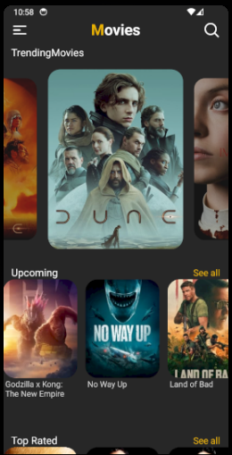

# Movie Catalog

This is a comprehensive guide for the "Movie Catalog" project in react native, an example application that implements the basic styling and api integration. The project is made with expo that facilitates testing and integration with phone functionalities.

## Information

- **Title**: Movie Catalog
- **Version**: 1.0
- **Preview**:

  

## Prerequisites

Before getting started, make sure you have the following prerequisites installed on your system:

- [Node](https://nodejs.org/): Javascript runtime.
- [PNPM](https://pnpm.io/): Package manager.
- [Expo go](https://expo.dev/go): Expo Go is a sandbox that enables you to quickly experiment with building native Android and iOS apps.

## Installation

Follow the steps below to install the project in your development environment:

1. **Clone the repository:**

   ```
   git clone https://github.com/LucasTravessa/movie-catalog.git
   ```

2. **Navigate to the project directory:**

   ```
   cd movie-catalog
   ```

3. **Installing the packages(with PNPM installed on your machine):**

   ```
   pnpm install
   ```

## Running the Application

After installation, you can run the Movie Catalog application with the following command:

```
pnpm start
```

The application will be accessible via Expo Go.

## Credits

The project was based of a youtube video called: [Build Movie App Using React Native | React Native Projects | Beginners ](https://www.youtube.com/watch?v=Q1xQuCpYIFE&list=PLKWMD009Q4qSHIMF6Swy4VQs5z6U97LJm)

And the models from the TMDB api was based of some projects found on github: [tmdb-ts-api](https://github.com/medeskisolutions/tmdb-ts-api) and [tmdb-typescript-api](https://github.com/xusoo/tmdb-typescript-api)
